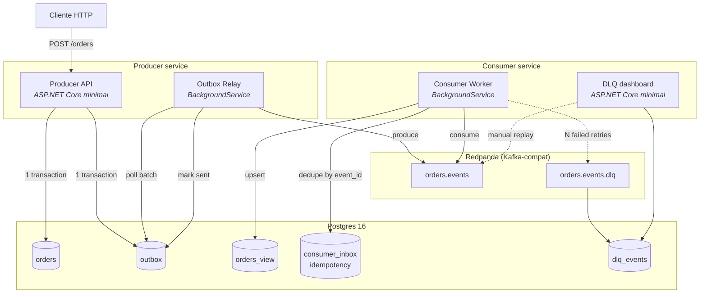

# Arquitetura

Diagramas C4 nível 1 (contexto) e nível 2 (container) do `event-spine`, com foco nas fronteiras e nos pontos onde as decisões arquiteturais moram (cada uma linkada a uma ADR).

## C1 — Contexto

O sistema é uma implementação de referência do fluxo **write-through-outbox → consume-idempotently → project-materialized-view**, aplicada a um domínio de pedidos (Orders). Dois atores externos:

```mermaid
graph LR
    Client["Cliente HTTP<br/>(app, teste, curl)"]
    subgraph EventSpine["event-spine"]
        Producer[Producer API]
        Consumer[Consumer Worker]
        Projection[(Projection<br/>read model)]
    end
    Reader["Leitor de projeção<br/>(HTTP GET /orders)"]

    Client -->|POST /orders<br/>PUT /orders/{id}/pay| Producer
    Producer -.->|eventos| Consumer
    Consumer --> Projection
    Reader -->|GET /orders| Projection
```

**Escopo do sistema.** Apenas as caixas dentro de `event-spine`. Cliente e leitor são atores externos; usados nos testes end-to-end mas não fazem parte da entrega.

**Não escopo.** UI, autenticação, orquestração de saga, event sourcing puro (sem snapshots ou upcasting). Estes ficam fora — o objetivo é `outbox + idempotência + projeção + DLQ` limpos, não um clone de e-commerce.

## C2 — Containers



**Fronteiras.** Cada `subgraph` é uma unidade que dá pra escalar, monitorar e deployar separadamente. Producer API e Relay compartilham DB porque a transação outbox exige — mas rodam como processos distintos (`dotnet run`).

**Decisões chave, linkadas às ADRs.**

- Por que outbox e não dual write: [ADR-001](adr/001-outbox-vs-dual-write.md).
- Redpanda em vez de Kafka/RabbitMQ: [ADR-002](adr/002-broker-choice.md) *(escrever antes do release v0.1)*.
- Política de retry e critério de DLQ: [ADR-003](adr/003-retry-and-dlq-policy.md) *(escrever antes do release v0.1)*.

## Fluxo end-to-end (happy path)

1. Cliente `POST /orders` na Producer API.
2. Producer abre transaction em Postgres, escreve linha em `orders` e linha em `outbox` (mesmo `Id` do evento), commit.
3. Outbox Relay (worker separado) faz poll periódico do `outbox` por linhas `sent_at IS NULL`, produz cada uma no tópico `orders.events` do Redpanda com chave `= order_id` (garante ordem por ordem, distribui carga entre partitions), marca `sent_at = now()`.
4. Consumer Worker consome `orders.events`. Antes de processar, faz `INSERT INTO consumer_inbox (event_id) ON CONFLICT DO NOTHING`. Se conflitou, é replay — descarta.
5. Se novo, aplica na `orders_view` (upsert por `order_id`, respeitando ordem por versão do evento).
6. Cliente lê `GET /orders/{id}` na projeção materializada.

## Fluxo de falha

- **Producer crasha entre insert e commit:** ambos os inserts revertem juntos — transação atômica. Nada foi produzido no tópico.
- **Relay crasha depois de produzir e antes de marcar sent:** próximo poll re-produz o mesmo evento. Consumer descarta via inbox (idempotência).
- **Consumer crasha no meio de um lote:** partition offset não é comitado — Kafka reentrega. Idempotência por `event_id` garante que não duplica no projection.
- **Consumer falha N vezes seguidas num evento envenenado:** vai pro DLQ (`orders.events.dlq`) com o motivo. DLQ dashboard permite inspecionar, corrigir causa raiz e replay manual pro tópico principal.

## Observabilidade

OpenTelemetry ligado nos dois serviços via `Microsoft.Extensions.Hosting`:

- **Traces** com propagação via header `traceparent`: request HTTP → transaction Postgres → produce Kafka → consume Kafka → upsert projection.
- **Metrics** de contadores por status (produced, consumed, dedup_hit, dlq_sent) e histogramas de latência (outbox_to_kafka_ms, kafka_to_projection_ms).
- Exportador padrão = console; exportador OTLP opcional (Jaeger/Tempo/Grafana) via env var.

## Testes

- **Unit** — regras isoladas (mapeamento evento→projection, idempotência key).
- **Integration** — Testcontainers subindo Postgres + Redpanda por classe de teste. Cobrem fluxos end-to-end (happy path, replay, DLQ) sem depender do docker-compose de dev.
- **Chaos** *(v0.1 final)* — mata o Consumer no meio de um lote via `docker kill`, verifica que replay não duplica e que ordem por chave é mantida.
